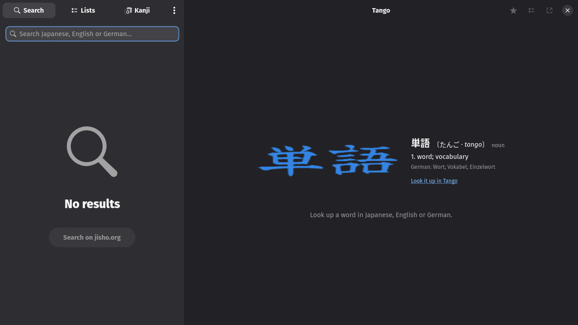

<div align="center">
  
  <h1>Tango 単語</h1>
  <p>A Japanese dictionary for GNOME</p>
  <a href="https://github.com/felsenuboot/tango/actions/workflows/ci.yml"></a>
  <a href="https://github.com/felsenuboot/tango/releases"></a>
</div>

Tango is an offline Japanese dictionary for the GNOME desktop, written in Rust
with GTK 4 and libadwaita. JMdict and Wadoku side by side, English and German,
kanji with stroke order, word lists, and the search a Jisho user expects.



> [!NOTE]
> A personal project, written largely with Claude Code and reviewed by a
> human. It works on my machine (Arch, Hyprland). No warranty.

## Features

- 🔍 **Search the way you think.** Kana, kanji, romaji, English or German.
  Inflected forms find their dictionary entry with the chain shown
  (書かれました → 書く: passive, polite, past); a pasted sentence is cut into
  words; `#common`, `#verb` and friends filter; `"quotes"` and `*` wildcards
  do what they say. Everything answers in a few milliseconds.
- 📖 **Two dictionaries.** JMdict from the EDRDG, with its German, Dutch and
  French glosses lined up with the English meanings, and every detail it
  carries: usage and field tags, dialects, notes, loanword origins, "see
  also" links, and what it says about each form; Wadoku from wadoku.de
  with pitch accent shown as ⓪ ① ② beside the reading. Search covers both,
  in the order you set.
- 🏷️ **Names.** JMnedict, the EDRDG's names file, as a dictionary of its
  own: exact matches show up after the words, `#names` searches nothing
  else.
- 🎓 **JLPT levels.** An opt-in download of Jonathan Waller's unofficial N5–N1
  lists: a level chip on the entry and in the results, `#jlpt-n5` … `#jlpt-n1`
  as filters or on their own to list a level.
- 💬 **Example sentences.** Tatoeba sentences under every entry that has
  them, English and German side by side, the word in bold; `#sentences` in the
  search box searches the sentences themselves, and a sentence page names
  the words in it.
- 🈷 **Kanji.** Click a kanji in a headword for its page: stroke order from
  KanjiVG, written stroke by stroke on request, readings, meanings, grade,
  JLPT level, frequency, its parts, and the words that use it. Find a kanji
  by its parts on the Kanji page of the sidebar.
- ⭐ **Word lists.** Star an entry for Favourites, add it to any list from the
  button above the entry or a right-click on a result. Export as CSV, for
  Anki, Kitsun or Takoboto; import a CSV or a Takoboto export; back up all
  lists as JSON.
- 🔗 **Elsewhere.** Open an entry on Jisho, Wadoku, Japanese Wikipedia or
  Wiktionary, or in Takoboto; open Takoboto links in Tango; a search that
  finds nothing offers the same query on jisho.org.
- 🗂️ **Dictionaries page.** Every source with version, import date and entry
  count; update, remove, toggle. Downloads and imports run in the background,
  queued, while you keep searching. Nothing is bundled; downloads happen on
  request.
- 🐊 **WaniKani.** Connect an account on the Accounts page (the token lives
  in the keyring): entries and kanji pages show the WaniKani level and SRS
  stage, `#known`, `#unknown`, `#kanji-known` and `#wk-level-12` filter by
  what you have learned, and the Lists page has a WaniKani list of every
  synced word and kanji, filterable by kind, level and stage, exportable
  like any list.
- 🎨 **Desktop.** Adaptive layout; Follow system, Light and Dark, plus
  themes: WaniKani (blue accent on your base), WaniKani Dark, Light and
  Pink, and four Sanzo Wada colour combinations; your own
  `~/.config/tango/style.css` loads on top of any of them,
  keyboard shortcuts (`Ctrl+F` / `/` search, `Ctrl+D` star, `Ctrl+I` import,
  `Ctrl+,` preferences).

The [tour](docs/TOUR.md) shows each of these with screenshots.

## Install

Rust 1.85+, GTK 4.12+, libadwaita 1.5+, SQLite, liblzma, libsecret.

```
git clone https://github.com/felsenuboot/tango.git
cd tango
./install.sh
```

**Arch Linux.** `./install.sh` builds the `tango-git` package from the
checkout (`packaging/arch/PKGBUILD`, following the Rust package guidelines)
and installs it with pacman; `makepkg -si` in `packaging/arch` builds it from
GitHub instead.

**Anywhere else.** `./install.sh` puts a release build into `~/.local/bin`
with the desktop entry and icons. Or just `cargo run` from the checkout.

| Distribution | Packages |
| --- | --- |
| Arch | `rust gtk4 libadwaita sqlite xz libsecret` |
| Debian, Ubuntu | `cargo libgtk-4-dev libadwaita-1-dev libsqlite3-dev liblzma-dev libsecret-1-dev` |

There is no Flatpak, and Flathub is not planned.

On first start, click **Download JMdict** (about 22 MB). Wadoku, KANJIDIC2,
KanjiVG, the radical index, the JMnedict names, the JLPT lists and the
Tatoeba sentences are one click each on the Dictionaries page in Preferences.

## Dictionaries and licences

- [JMdict](https://www.edrdg.org/wiki/index.php/JMdict-EDICT_Dictionary_Project),
  [JMnedict](https://www.edrdg.org/enamdict/enamdict_doc.html),
  [KANJIDIC2](https://www.edrdg.org/wiki/KANJIDIC_Project.html) and
  [RADKFILE](https://www.edrdg.org/krad/kradinf.html) are the property of the
  Electronic Dictionary Research and Development Group and used under its
  [licence](https://www.edrdg.org/edrdg/licence.html) (CC BY-SA 4.0).
- [Wadoku](https://www.wadoku.de/) (Japanese–German, with pitch accent) is
  © Ulrich Apel and the Wadoku.de contributors, used under the
  [Wadoku dictionary licence](https://www.wadoku.de/wiki/display/WAD/W%C3%B6rterbuch+Lizenz),
  which allows use in free software with attribution.
- [KanjiVG](https://kanjivg.tagaini.net/) stroke order data is © Ulrich Apel,
  Creative Commons Attribution-ShareAlike 3.0.
- [Tatoeba](https://tatoeba.org/) sentences and the Tanaka corpus index are
  released under Creative Commons Attribution 2.0 France.
- The JLPT lists are [Jonathan Waller's](http://www.tanos.co.uk/jlpt/)
  (CC BY), with JMdict numbers added by Stephen Kraus in
  [yomitan-jlpt-vocab](https://github.com/stephenmk/yomitan-jlpt-vocab)
  (CC BY-SA 4.0). They are unofficial; there are no official lists.

Everything is downloaded on request from the Dictionaries page; nothing is
bundled with the app.

## Roadmap

External links, and the WaniKani and MaruMori integrations. Tracked as
[milestones](https://github.com/felsenuboot/tango/milestones); the order and
the reasoning are in [docs/ROADMAP.md](docs/ROADMAP.md).

## Development

See [docs/DEVELOPMENT.md](docs/DEVELOPMENT.md) for the code layout, tests,
the autopilot for scripted UI runs and screenshots, the branch-and-release
process, and a reading order for the Rust newcomer.

## Manual checks

What the headless runs cannot verify and Felix still has to try on a real
desktop. Tick and delete when done; a bug goes into a new issue.

- [ ] **#37 narrow sidebar.** Resize the window to about 830 px wide: the
  Search / Lists / Kanji switcher should show icons with the label
  underneath instead of "Se… / Li… / Ka…"; below 640 px the sidebar takes
  the whole window and the switcher stays narrow.
- [ ] **#36 background queue.** On the Dictionaries page click Download on
  three sources in a row: the rows show "Queued…" then the progress line, a
  spinner turns in the sidebar header, the search keeps working, and
  closing the window asks "Keep running / Quit anyway".
- [ ] **#36 rebuild.** After the next schema bump a toast says the
  dictionaries are being imported again and every cached source comes back
  by itself; "Import downloaded copy" appears on sources with a cached file.
- [ ] **#38 hide parts.** Kanji page: pick 田, press the eye toggle: the
  parts that no longer fit disappear and their stroke groups collapse; the
  setting survives a restart.
- [ ] **#39 spacing.** The search entry, the Kanji page and the "Add to list"
  popover keep 12 px from the edges on a normal and on a HiDPI screen.
- [ ] **#20 links.** The "Open on another site" button offers Jisho, Wadoku,
  Wikipedia and Wiktionary for a Wadoku entry and adds Takoboto for a JMdict
  entry; a search that finds nothing offers "Search on jisho.org", and both
  open the browser.
- [ ] **#19 JLPT.** Download "JLPT" on the Dictionaries page (about 400 kB),
  then search `#jlpt-n5` and open 食べる: the green N5 chips show.
- [ ] **#6 sentences.** Open 猫, scroll to the example sentences, press
  "Show all", then try `#sentences 猫が` and a word button on the sentence page.
- [ ] **#17 details.** Open パソコン ("abbreviation" chip, "See also"
  button) and アルバイト ("from German: Arbeit").
- [ ] **#18 names.** Search 田中: the surname rows come after the word;
  `#names さとう` lists names only.
- [ ] **#58 themes.** Preferences → General → Theme: every entry of the list
  is legible on the entry page, the sidebar rows, the Dictionaries page and
  the kanji diagram; WaniKani Pink and Wada 276 are light, the other Wada
  ones dark; a `~/.config/tango/style.css` with `.tango-headword { color: red; }`
  takes effect after a restart.
- [ ] **#11 WaniKani.** Preferences → Accounts: paste a read-only token and
  Connect; the row shows your username and level, the first sync runs in the
  background (about thirty requests, half a minute), then 食べる shows a
  purple "WaniKani 6 · Guru" chip (or whatever your stage is), the kanji page
  of 食 too, and `#known` / `#kanji-known` filter. Sync now and Disconnect
  work; after Disconnect the keyring item "Tango: wanikani API token" is gone.
- [ ] **#55 WaniKani list.** Lists → WaniKani: the three filters narrow the
  rows, a word row opens its entry, a kanji row its page, Export as… writes
  the filtered rows, and Rename / Delete refuse with a toast.

## Name and licence

単語 (*tango*) is the Japanese word for "word". MIT licence, see
[LICENSE](LICENSE).
