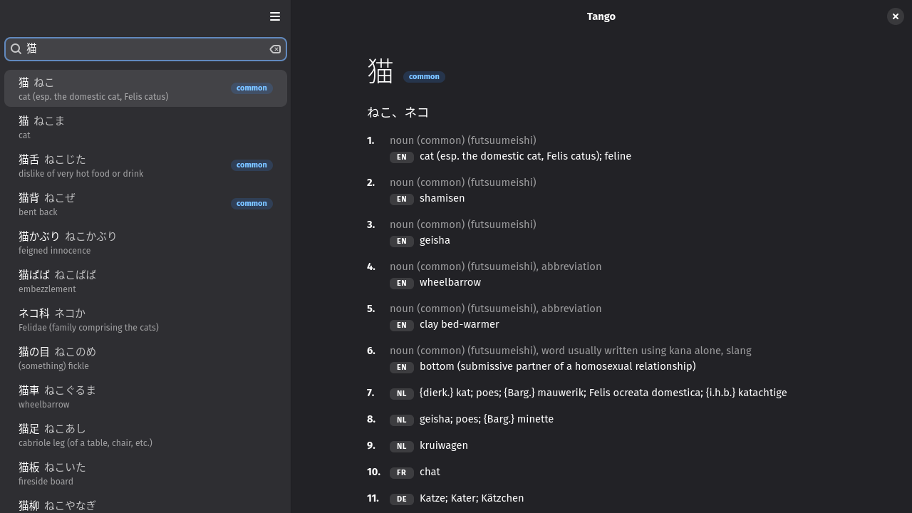

#  Tango 単語

[](https://github.com/felsenuboot/tango/actions/workflows/ci.yml)

A Japanese dictionary for the GNOME desktop: GTK 4, libadwaita and Rust.
Offline, with English and German glosses side by side.

> [!NOTE]
> Early scaffold. It imports JMdict and searches it; everything under
> *Roadmap* is still to come. Personal project, written largely with Claude
> Code and reviewed by a human. No warranty.



## What works

- **JMdict import.** Download the file from inside the app (about 22 MB) or
  import a local copy. ~220k entries land in a local SQLite file in seconds.
- **Search.** Type kana, kanji or romaji for a headword/reading lookup, or an
  English or German word for a gloss lookup. Inflected forms find their
  dictionary entry with the chain shown (書きました → 書く: polite, past); a
  pasted sentence is cut into words. `#common`, `#verb`, `#noun` and friends
  filter, `"quotes"` mean exactly that, `*` and `?` are wildcards. Exact
  matches and common words come first.
- **Entries.** Headword, readings, alternative spellings, every meaning with
  its parts of speech and the translations per language in the order you
  prefer. JMdict ships the German, Dutch and French glosses as separate
  senses; Tango lines them up with the English meanings where the sense
  counts match and lists the rest per language.
- **Word lists.** Star an entry (Ctrl+D) for Favourites or add it to any list
  from the button next to the star, or right-click a result row for the same
  plus copying and Takoboto; the Lists page in the sidebar browses,
  renames and reorders them. Export a list as CSV, for Anki, for Kitsun or in
  Takoboto's layout, import a CSV of words or a Takoboto export, and back up
  all lists as JSON.
  "Open in Takoboto" above an entry, and `tango https://takoboto.jp/?w=…`
  opens the entry from a link.
- **Kanji.** Click a kanji in a headword, or search a single kanji, for its
  page: stroke order from KanjiVG with numbered strokes and a play button,
  readings, meanings, stroke count, grade, JLPT level and frequency from
  KANJIDIC2, its parts, and the words that use it. The Kanji page in the
  sidebar finds kanji by their parts, with a stroke-count filter.
- **Wadoku.** The Japanese–German dictionary from wadoku.de next to JMdict,
  with pitch accent shown as ⓪ ① ② beside the reading. Search covers both;
  a chip marks Wadoku entries.
- **Dictionaries page.** Preferences lists every source with its version,
  import date and entry count, with update, remove and a search toggle per
  dictionary.
- Adaptive layout (sidebar collapses on narrow windows), light and dark theme (follow the system or force one),
  keyboard shortcuts (`Ctrl+F` / `/` search, `Ctrl+I` import, `Ctrl+,` preferences).

## Roadmap

- Example sentences from Tatoeba

Everything above plus the WaniKani, MaruMori, Kitsun.io and Takoboto
integrations is tracked in the [issues](https://github.com/felsenuboot/tango/issues);
the order and the reasoning are in [docs/ROADMAP.md](docs/ROADMAP.md).

## Install

Rust 1.85+, GTK 4.12+, libadwaita 1.5+, SQLite, liblzma.

```
git clone https://github.com/felsenuboot/tango.git
cd tango
./install.sh
```

On Arch Linux that builds the `tango-git` package from the checkout
(`packaging/arch/PKGBUILD`, following the Rust package guidelines) and installs
it with pacman; `makepkg -si` in `packaging/arch` builds it from GitHub instead.
Anywhere else it puts a release build into `~/.local/bin` with the desktop entry
and icons (Debian/Ubuntu: `cargo libgtk-4-dev libadwaita-1-dev libsqlite3-dev liblzma-dev`).
Or just `cargo run` from the checkout. There is no Flatpak, and Flathub is not
planned.

## Dictionaries and licences

- [JMdict](https://www.edrdg.org/wiki/index.php/JMdict-EDICT_Dictionary_Project) is
  the property of the Electronic Dictionary Research and Development Group and
  used under its [licence](https://www.edrdg.org/edrdg/licence.html)
  (CC BY-SA 4.0). The app downloads it on first use; nothing is bundled.
- [KANJIDIC2](https://www.edrdg.org/wiki/KANJIDIC_Project.html) and
  [RADKFILE](https://www.edrdg.org/krad/kradinf.html) are the property of the
  EDRDG and used under the same licence as JMdict (CC BY-SA 4.0).
- [KanjiVG](https://kanjivg.tagaini.net/) stroke order data is © Ulrich Apel,
  Creative Commons Attribution-ShareAlike 3.0.
- [Wadoku](https://www.wadoku.de/) (Japanese–German, with pitch accent) is
  © Ulrich Apel and the Wadoku.de contributors, used under the
  [Wadoku dictionary licence](https://www.wadoku.de/wiki/display/WAD/W%C3%B6rterbuch+Lizenz),
  which allows use in free software with attribution. Downloaded on request
  from the Dictionaries page; nothing is bundled.

## Development

See [docs/DEVELOPMENT.md](docs/DEVELOPMENT.md) for the code layout, tests,
the autopilot for scripted UI runs and screenshots, and a reading order for
the Rust newcomer.

## Licence

MIT, see [LICENSE](LICENSE).
