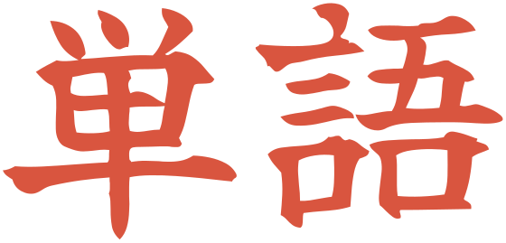

# Tango tour

<table>
<tr>
<td width="300" valign="top"></td>
<td valign="top">

**単語** 〔たんご · *tango*〕 noun
1. word; vocabulary

German: Wort; Vokabel; Einzelwort · [jisho.org](https://jisho.org/search/%E5%8D%98%E8%AA%9E)

</td>
</tr>
</table>

## The first ten minutes

1. **Download JMdict** when the app asks (about 22 MB, imported in a few
   seconds). Wadoku, the kanji data, the Tatoeba sentences, the names file
   and the JLPT lists are one click each on the Dictionaries page in
   Preferences; they queue up and import in the background while you search.
2. **Search anything:** 猫, neko, cat, Katze, an inflected form like
   書かれました, a whole sentence. `#common`, `#verb`, `#jlpt-n5` and the
   other tags narrow it; a search that finds nothing offers jisho.org.
3. **Open a kanji** by clicking it in a headword: stroke order, readings,
   meanings, parts, the words that use it. The Kanji page of the sidebar
   finds one by its parts.
4. **Keep words.** `Ctrl+D` stars an entry into Favourites; the button next
   to the star adds it to a list. An opened list fills the content pane with
   cards, or the sidebar with tiles. Lists export for Anki, Kitsun and
   Takoboto and import from CSV or a Takoboto export.
5. **Connect WaniKani** in Preferences → Accounts with a read-only token:
   entries and kanji show your SRS stage, `#known` and `#unknown` filter,
   and the Lists page gets a WaniKani list.
6. **Make it yours** in Preferences: which languages an entry shows and in
   which order, the theme (system, light, dark, WaniKani, Sanzo Wada), your
   own `~/.config/tango/style.css` on top.

Wherever you click through, the back button in the header (or `Alt+Left`)
returns to where you came from.

## The guide

One page per topic, with screenshots:

- [Search](guide/search.md): what a query can be, tags, quotes and wildcards, inflected forms, sentences, names, JLPT, no results, back
- [Entries](guide/entries.md): JMdict and Wadoku side by side, the languages, pitch accent and speech, every detail JMdict carries, links elsewhere
- [Example sentences](guide/sentences.md): Tatoeba under an entry, `#sentences`, the sentence page
- [Kanji](guide/kanji.md): the kanji page, stroke order, search by parts
- [Word lists](guide/lists.md): Favourites, lists, cards and tiles, export and import
- [Dictionaries](guide/dictionaries.md): the sources, the queue, updates, licences
- [WaniKani](guide/wanikani.md): connecting, the chips, the filters, the WaniKani list
- [Themes](guide/themes.md): the schemes, the playful ones, custom CSS
- [Keyboard shortcuts](guide/shortcuts.md): every key

## What it looks like

