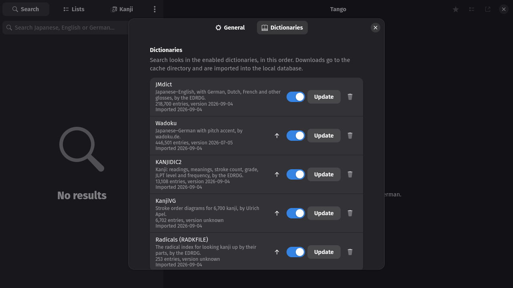

# Tango tour

Every screen below is a headless capture of the app with the real
dictionaries installed, German as the preferred language, dark theme unless
said otherwise.

## Search

Type kana, kanji, romaji, English or German. Exact matches and common words
come first; entries in a word list carry a star.

Inflected forms find their dictionary form and say how: 書かれました is 書く,
passive, polite, past.

A pasted sentence is cut into words, each with its own group of results.

`#common`, `#verb`, `#noun`, `#adjective` and the other tags filter; a query
in `"quotes"` means a whole gloss or an exact form; `*` and `?` are wildcards.

## Two dictionaries

JMdict lists its German, Dutch and French glosses as separate senses. Tango
lines them up with the English meanings where the sense counts match and
lists the rest per language. Wadoku entries show the pitch accent beside the
reading: ④ means the pitch drops after the fourth mora, ⓪ is flat.

## Example sentences

With Tatoeba installed, an entry ends with its example sentences: the word
in bold, English and German underneath, good examples first, "Show all" for
the rest.

`#sentences` in front of a query searches the sentences themselves, in
Japanese or in a translation. A sentence page names the words the corpus
index found in it; each opens its entry.

## Kanji

Click a kanji in a headword, or search a single kanji and press the button
under the search box. The diagram numbers the strokes; the play button
writes the kanji stroke by stroke.

The Kanji page in the sidebar finds kanji by their parts. Parts that no
remaining kanji contains are greyed out; a stroke count narrows the grid.

## Word lists

Ctrl+D or the star above an entry puts it in Favourites; the button next to
the star, or a right-click on a result, adds it to any list. The Lists page
browses, renames, reorders and exports lists, and imports CSV files or
Takoboto exports.

## Dictionaries

Every source with its version, import date and entry count. Update
downloads today's file; the switch takes a dictionary out of the search.

## Themes

Follow the system, or force light or dark; the forced schemes hold even on
desktops that push their own GTK palette.

