# Tango tour

Every screen below is a headless capture of the app with the real
dictionaries installed, German as the preferred language, dark theme unless
said otherwise.

## Start

The app introduces itself as a dictionary entry: 単語, *tango*, is the word
for "word". "Look it up in Tango" runs that search.

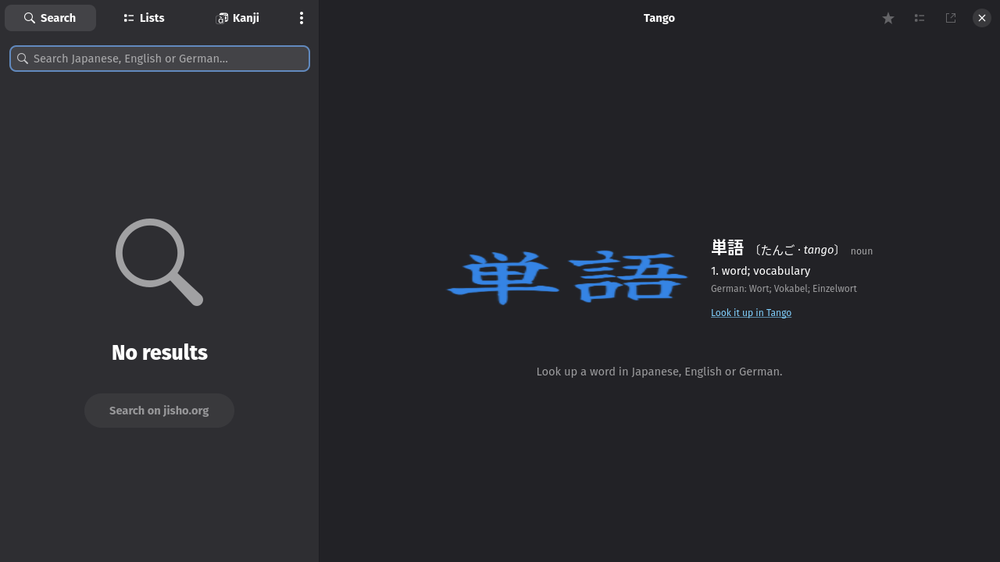

## Search

Type kana, kanji, romaji, English or German. Exact matches and common words
come first; entries in a word list carry a star.

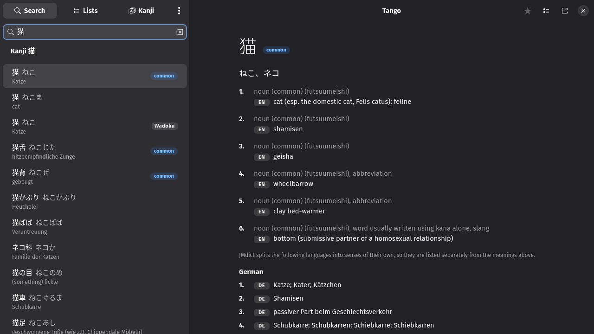

Inflected forms find their dictionary form and say how: 書かれました is 書く,
passive, polite, past.

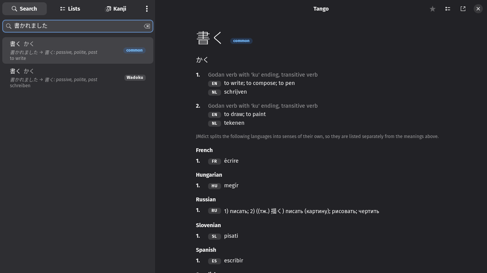

A pasted sentence is cut into words, each with its own group of results.

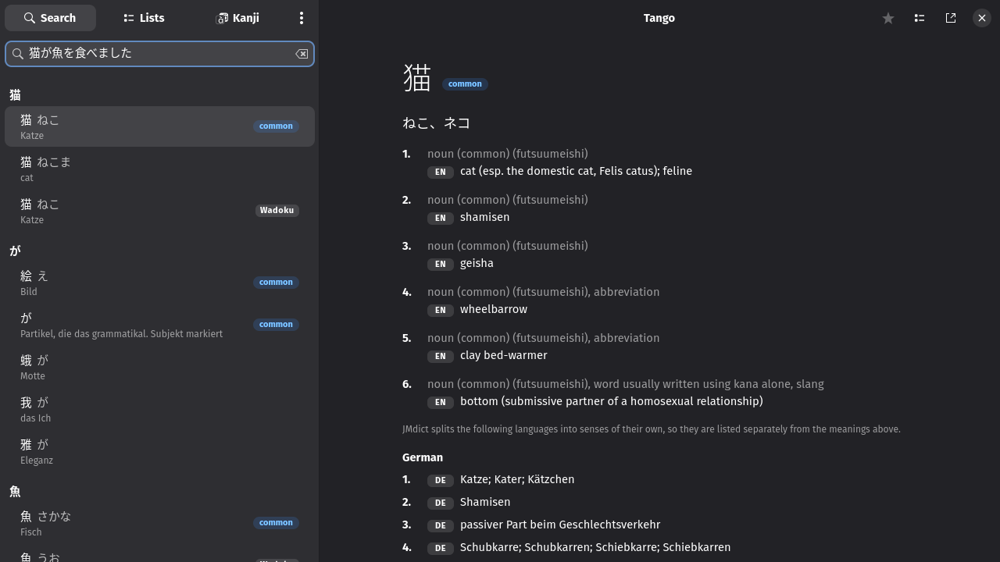

`#common`, `#verb`, `#noun`, `#adjective` and the other tags filter; a query
in `"quotes"` means a whole gloss or an exact form; `*` and `?` are wildcards.

`#names` searches JMnedict, the names file: people, places, companies. A
name also shows up, after the words, when a query matches one of its forms
exactly.

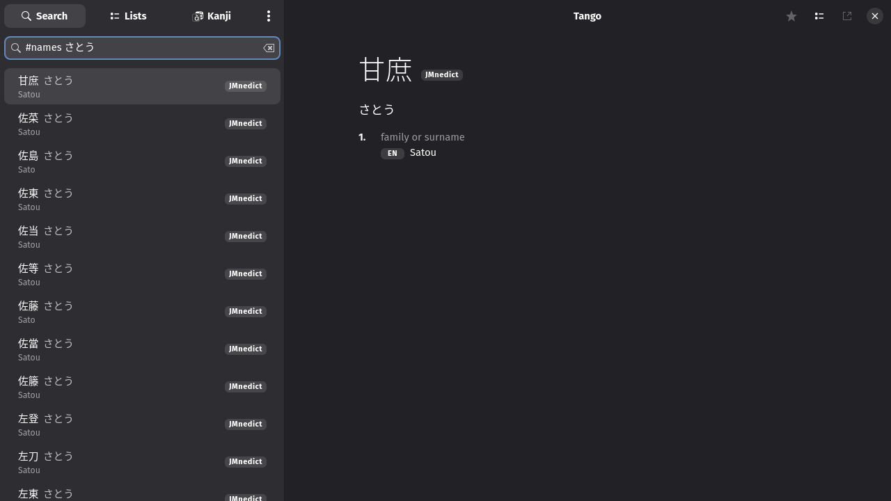

With the JLPT lists installed (an opt-in download; the lists are unofficial),
entries and rows carry a green level chip, `#jlpt-n5` … `#jlpt-n1` filter a
search, and on their own list a level.

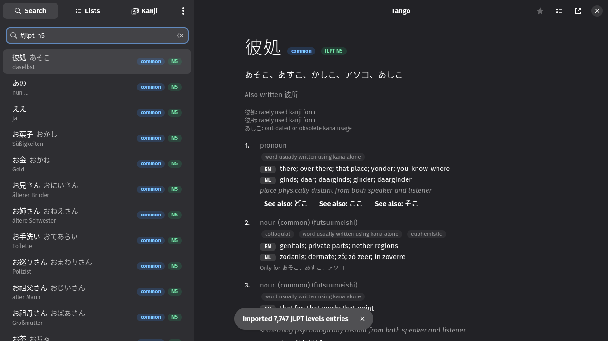

A search that finds nothing offers the same query on jisho.org in the
browser; the button above the entry opens it on Jisho, Wadoku, Japanese
Wikipedia or Wiktionary, and in Takoboto.

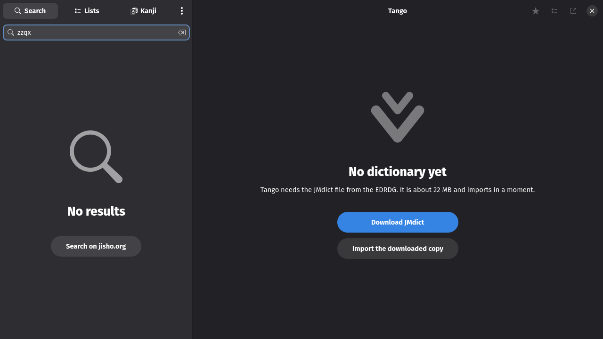

Wherever you click through, the back button in the header (or Alt+Left)
returns to the previous view: the entry a "See also" came from, the sentence
a word was opened from, the kanji page behind one of its words.

## Two dictionaries

JMdict lists its German, Dutch and French glosses as separate senses. Tango
lines them up with the English meanings where the sense counts match and
lists the rest per language. Wadoku entries show the pitch accent beside the
reading: ④ means the pitch drops after the fourth mora, ⓪ is flat, and a
graph under the reading draws it over the moras. A speaker button reads the
word or an example sentence aloud when speech-dispatcher has a Japanese
voice.

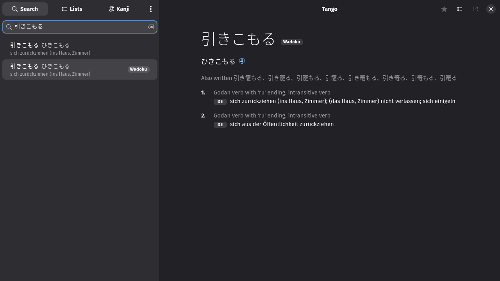

## Entry details

Everything JMdict says about an entry beyond its glosses: usage and field
tags as chips, dialects, notes in italics, where a loanword comes from
("from German: Arbeit"), what a sense is restricted to, and "See also" and
"Antonym" buttons that open the referenced entry. Under the readings, what
the file says about single forms ("猫脊: rarely used kanji form").

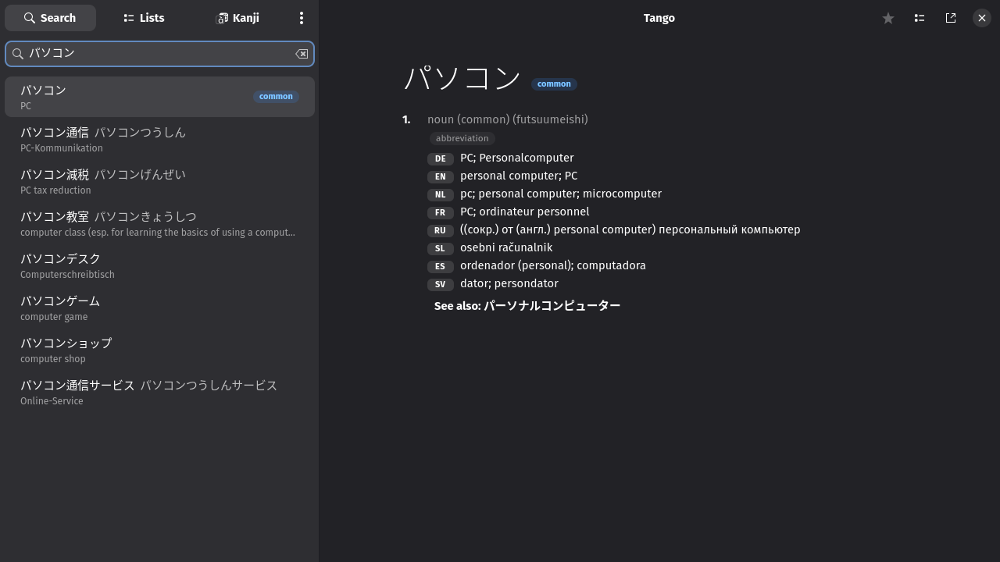

## Example sentences

With Tatoeba installed, an entry ends with its example sentences: the word
in bold, English and German underneath, good examples first, "Show all" for
the rest.

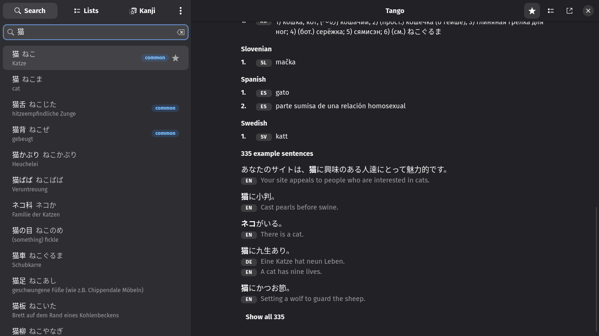

`#sentences` in front of a query searches the sentences themselves, in
Japanese or in a translation. A sentence page names the words the corpus
index found in it; each opens its entry.

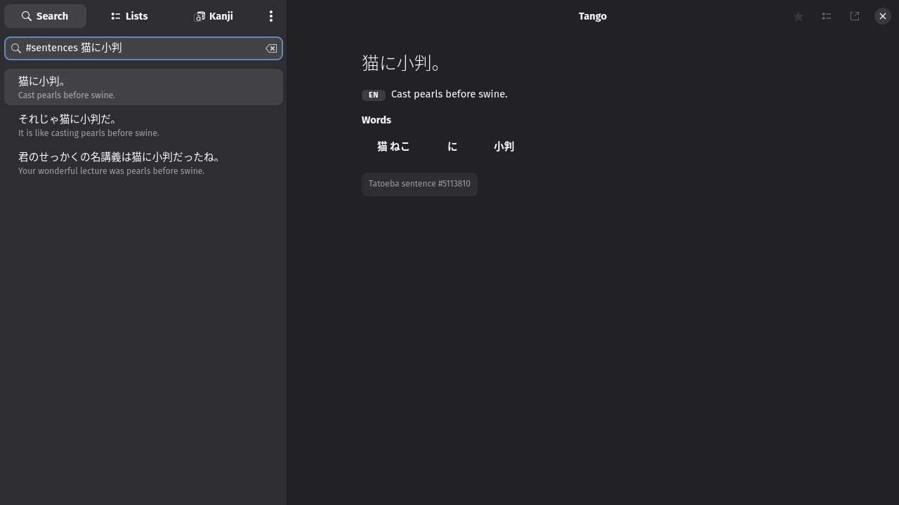

## Kanji

Click a kanji in a headword, or search a single kanji and press the button
under the search box. The diagram numbers the strokes; the play button
writes the kanji stroke by stroke.

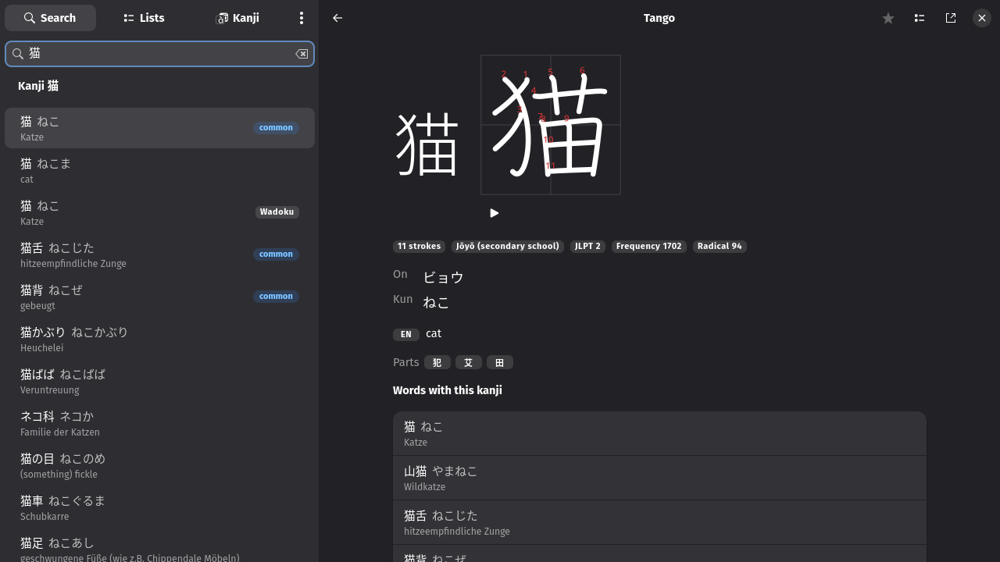

The Kanji page in the sidebar finds kanji by their parts. Parts that no
remaining kanji contains are greyed out, or hidden altogether with the eye
toggle so the picker stays short; a stroke count narrows the grid.

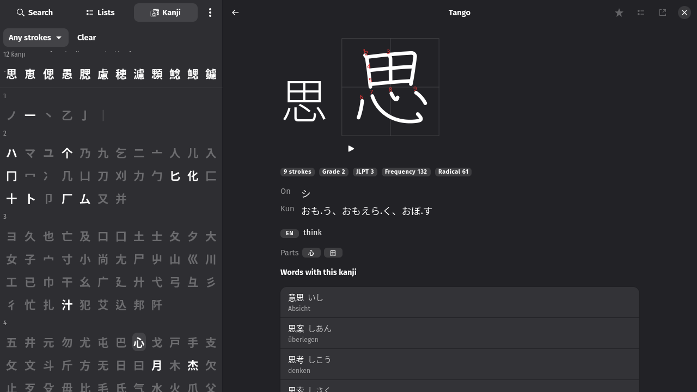

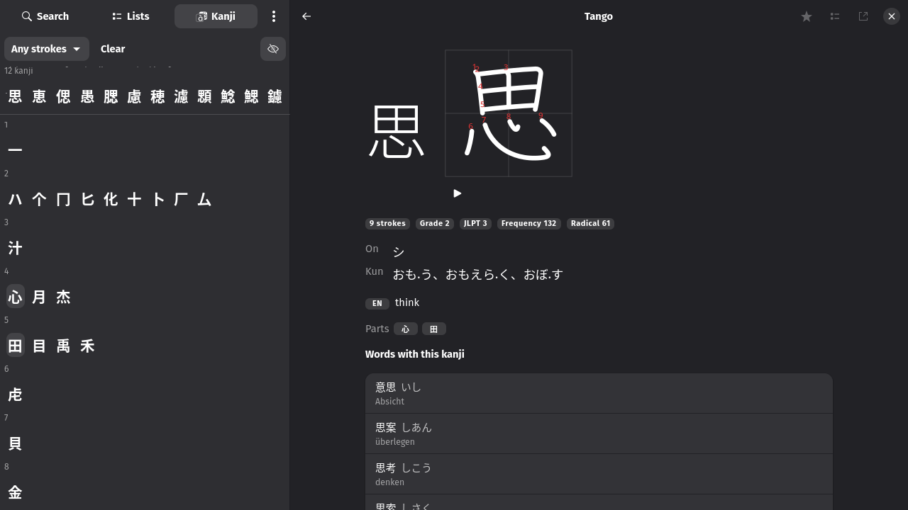

## Word lists

Ctrl+D or the star above an entry puts it in Favourites; the button next to
the star, or a right-click on a result, adds it to any list. The Lists page
browses, renames, reorders and exports lists, and imports CSV files or
Takoboto exports.

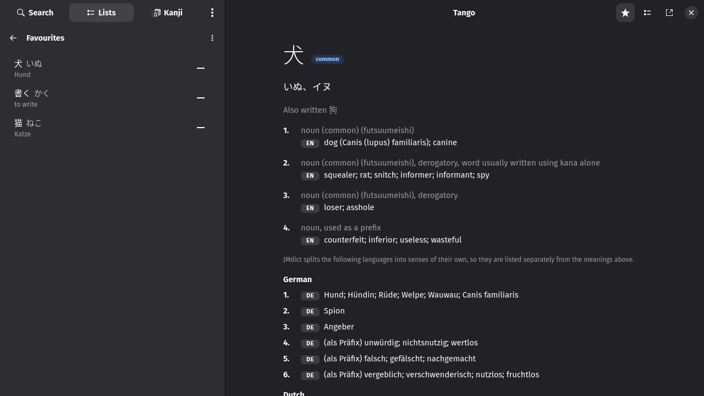

## Dictionaries

Every source with its version, import date and entry count. Update
downloads today's file; the switch takes a dictionary out of the search.
Downloads and imports queue up and run in the background: click Download on
three sources and keep searching while the rows show their progress.

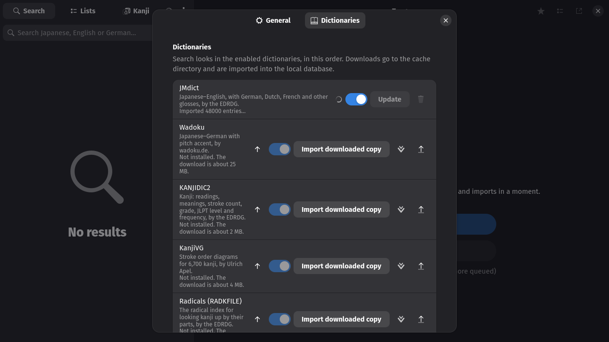

Which translations an entry shows is a switch per language on the General
page, with "Show first" among the enabled ones; an entry that has none of
them falls back to English, or whatever it has.

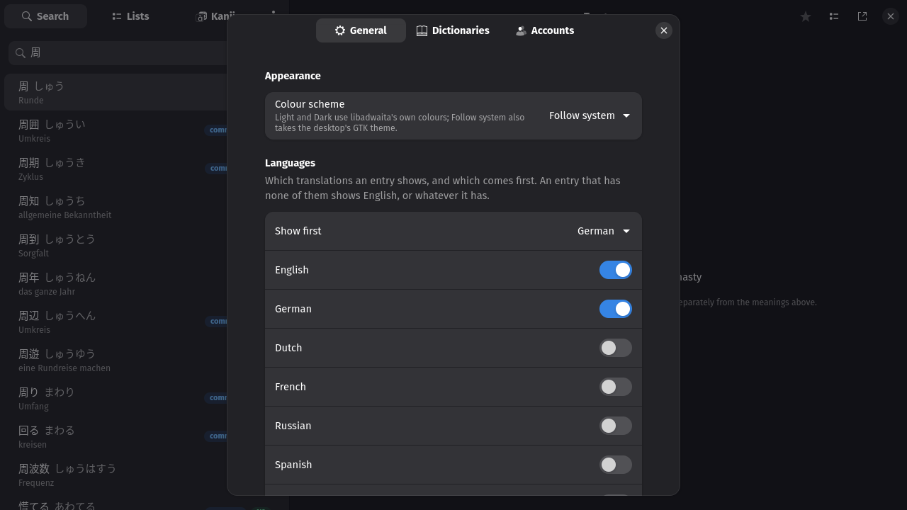

## WaniKani

Preferences → Accounts takes a read-only WaniKani token (it stays in the
keyring), checks it, and syncs the subjects and assignments in the
background; later syncs are incremental.

An entry then shows a WaniKani row: one chip per form the site knows, and
one per kanji, coloured by SRS stage in WaniKani's own palette (Apprentice
pink, Guru purple, Master blue, Enlightened light blue, Burned dark) with
the item kind as the left edge; the kanji page shows the same chip.
`#known`, `#unknown`, `#kanji-known` and `#wk-level-12` filter a search,
and `#known` alone lists what you have learned.

The Lists page has a WaniKani list of every synced word and kanji, filtered
by kind, level (one level, or everything up to one) and stage (one stage, or
everything unlocked), exportable like any list.

## Themes

Follow the system, or force light or dark; the forced schemes hold even on
desktops that push their own GTK palette. Beyond those: WaniKani (the
site's blue as accent on your base), WaniKani Dark, Light and Pink, and four
Sanzo Wada colour combinations. A `~/.config/tango/style.css` loads on top
of any of them.

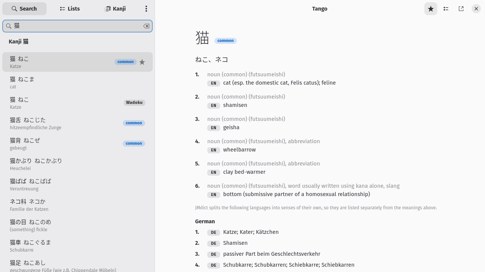

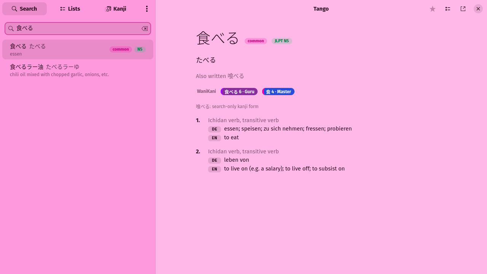

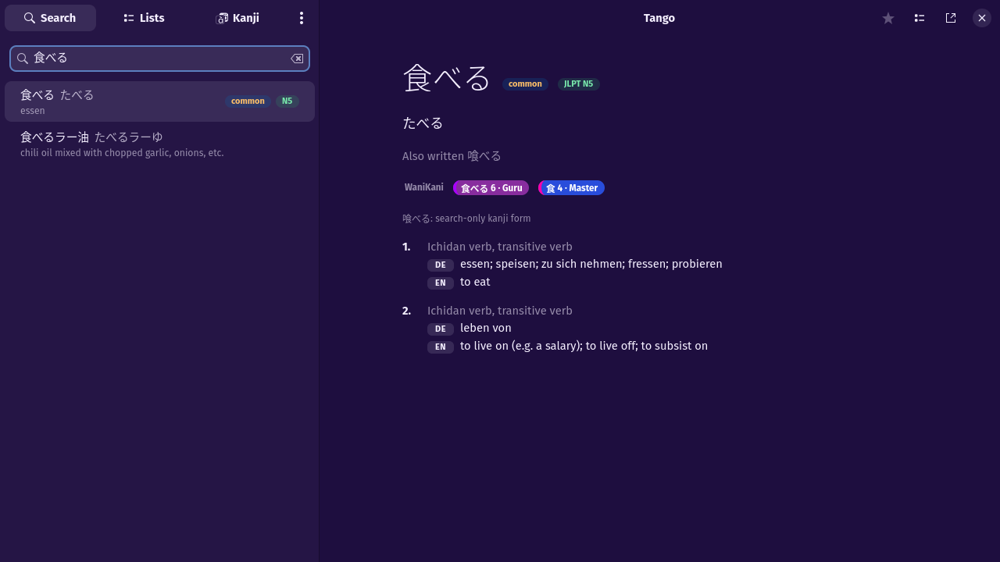
