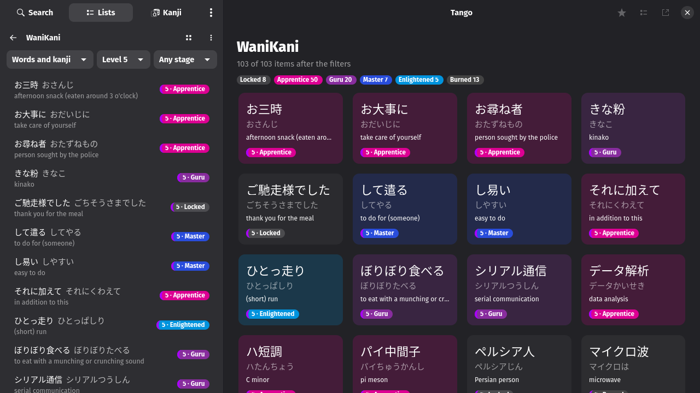
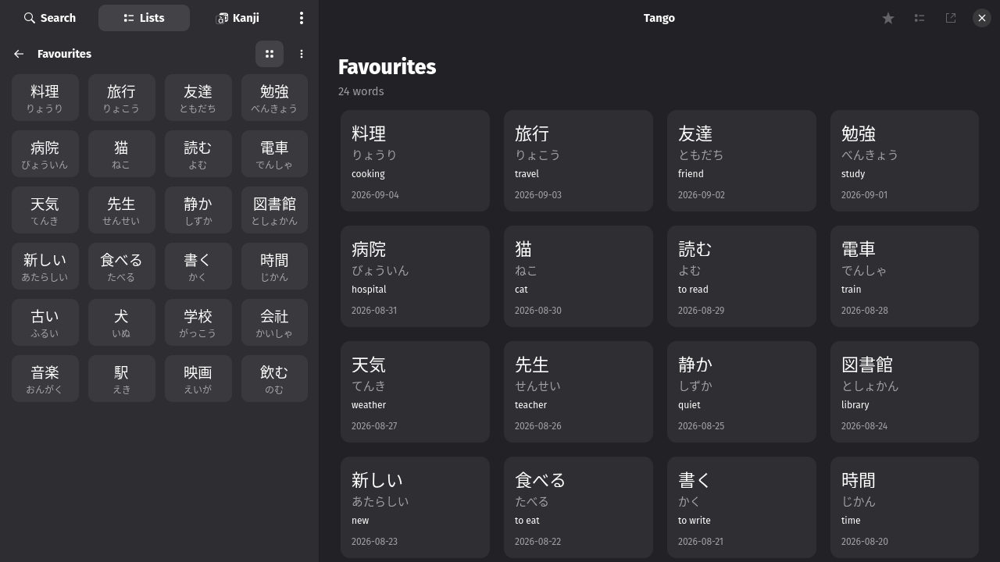

# Word lists

`Ctrl+D` or the star above an entry puts it in Favourites; the button next to
the star, or a right-click on a result, adds it to any list. The Lists page
browses, renames, reorders and exports lists, and imports CSV files or
Takoboto exports.

## Cards and tiles

Opening a list also fills the content pane with it, as cards: the word, its
reading, one line of meaning, and the day it was added, or for the WaniKani
list the stage chip on a stage-tinted card with the stage counts above.
Clicking a card opens the entry; Back returns to the cards.

The grid button in the list header turns the sidebar rows into tiles: the
word and its reading or stage, the meaning in the tooltip.

Both are switches under Preferences → General → Lists and results, and a
third switch applies them to search results as well (see
[Search](search.md#cards-and-tiles)).

Export as… writes a list as CSV, or in the shape Anki, Kitsun or Takoboto
import; Back up all lists writes them as one JSON file, which imports again
the same way. The WaniKani list on this page is described in
[WaniKani](wanikani.md).

---
[Guide index](README.md) · [Tour](../TOUR.md)
