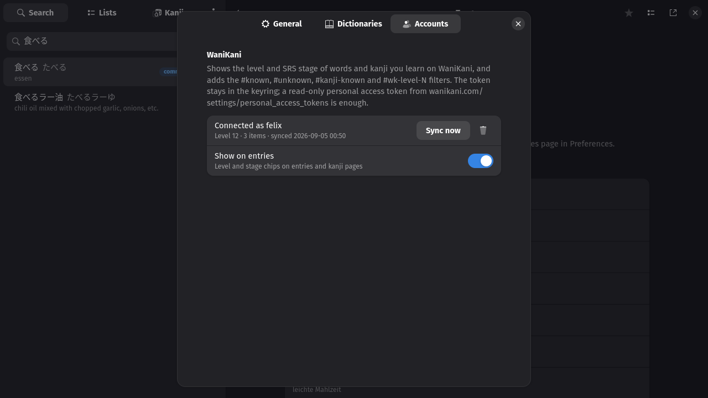
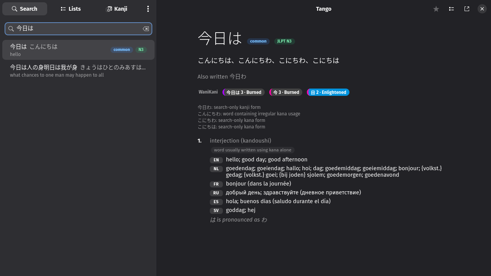
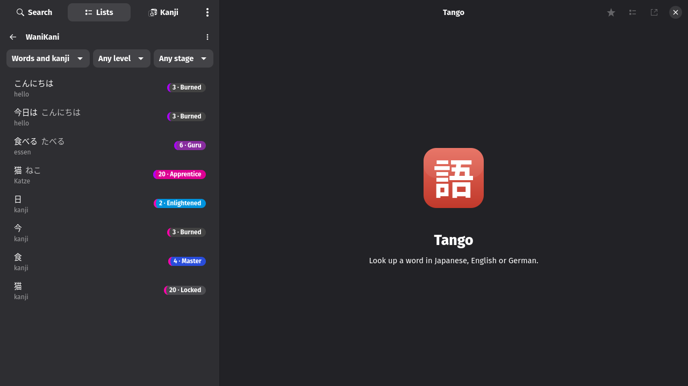

# WaniKani

## Connecting

Preferences → Accounts takes a read-only WaniKani token (it stays in the
keyring), checks it, and syncs the subjects and assignments in the
background; later syncs are incremental. Disconnect removes the token and
the synced data.

WaniKani spells some words differently from the dictionaries (ふじ山 where
JMdict has 富士山). The sync keeps each item's reading, and a word whose
spelling is no dictionary form is matched through the reading, provided its
kanji occur in the dictionary form. After updating to a version that stores
readings, the next sync fetches every subject again.

## The chips

An entry then shows a WaniKani row: one chip per form the site knows, and
one per kanji, coloured by SRS stage in WaniKani's own palette (Apprentice
pink, Guru purple, Master blue, Enlightened light blue, Burned dark) with
the item kind as the left edge; the kanji page shows the same chip.

## The filters

`#known`, `#unknown`, `#kanji-known` and `#wk-level-12` filter a search by
what you have learned (known means Guru or above), and `#known` alone lists
all of it.

## The WaniKani list

The Lists page has a WaniKani list of every synced word and kanji, filtered
by kind, level (one level, or everything up to one) and stage (one stage, or
everything unlocked), exportable like any list.

---
[Guide index](README.md) · [Tour](../TOUR.md)
